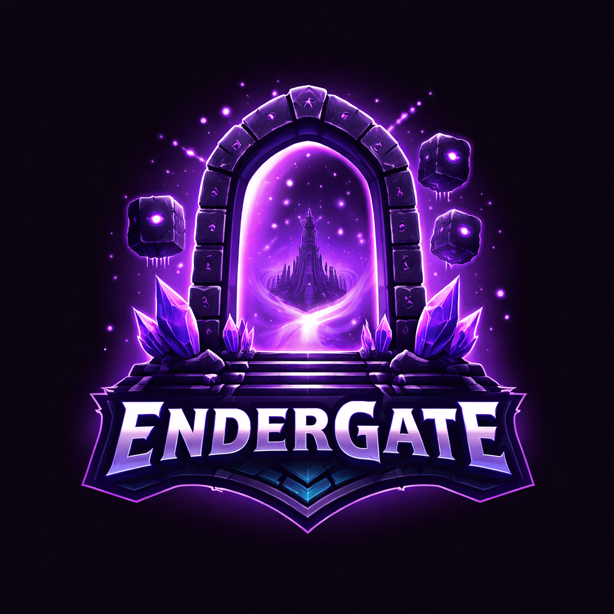

<div align="center">
  

  # Mr_Brodacz — CLIENT

  **Nowoczesny, nieoficjalny launcher do Minecraft Java Edition**

  [](https://www.electronjs.org/)
  [](https://www.typescriptlang.org/)
  [](https://react.dev/)
  [](https://tailwindcss.com/)
  [](LICENSE)

  <br />

  [📥 Pobierz](#-instalacja) · [✨ Funkcje](#-funkcje) · [📖 Dokumentacja](#-architektura) · [🐛 Zgłoś błąd](https://github.com/your-github-username/minecraft-launcher/issues)

  ---
</div>

<br />

> [!NOTE]
> Mr_Brodacz — CLIENT wymaga ważnej licencji Minecraft Java Edition i konta Microsoft do logowania.

<br />

## ✨ Funkcje

<table>
<tr>
<td width="50%">

### 🎮 Gra
- Obsługa **Minecraft 1.17.2+** — wszystkie wersje
- **Fabric, Forge, NeoForge** — automatyczne wykrywanie
- **Paczki modów** — przeglądanie, instalacja i **uruchamianie jednym kliknięciem**
- **Auto-aktualizacja** paczek modów z CurseForge
- **Discord Rich Presence** — pokaż status gry

</td>
<td width="50%">

### 🧩 Mody i paczki
- Integracja z **CurseForge** i **Modrinth**
- Wyszukiwanie, filtrowanie i sortowanie
- Pobieranie modów z automatyczną weryfikacją
- Instalacja paczek modów z pełnym zarządzaniem
- **Graj** bezpośrednio z zainstalowanej paczki

</td>
</tr>
<tr>
<td width="50%">

### 🔒 Bezpieczeństwo
- Logowanie **Microsoft OAuth2** przez Xbox Live
- **Szyfrowane** przechowywanie tokenów (DPAPI/Keychain)
- **Context Isolation** + Sandbox
- Brak `nodeIntegration` w rendererze
- Weryfikacja hash pobranych plików

</td>
<td width="50%">

### 🎨 Interfejs
- **React** + **Tailwind CSS** — nowoczesny design
- Płynne **animacje** (Framer Motion)
- **Wielojęzyczność** — PL, EN + własne tłumaczenia
- Personalizacja **kolorów akcentu**
- Panel konsoli i system powiadomień

</td>
</tr>
</table>

<br />

## 📥 Instalacja

###  Windows

| Wariant | Opis | Plik |
|---------|------|------|
| **Instalator** *(zalecane)* | NSIS — skrót na pulpicie, menu start, deinstalator | `Mr_Brodacz-CLIENT-Setup-X.X.X.exe` |
| **Portable** | Bez instalacji — uruchom z dowolnej lokalizacji | `Mr_Brodacz-CLIENT-X.X.X-portable.exe` |

> Wymagania: Windows 10+ (64-bit) · 4 GB RAM · Konto Microsoft z MC Java

---

###  Linux

| Wariant | Dystrybucje | Plik |
|---------|------------|------|
| **AppImage** *(zalecane)* | Wszystkie | `Mr_Brodacz-CLIENT-X.X.X-x86_64.AppImage` |
| **DEB** | Debian, Ubuntu, Mint | `Mr_Brodacz-CLIENT-X.X.X-amd64.deb` |
| **RPM** | Fedora, RHEL, CentOS | `Mr_Brodacz-CLIENT-X.X.X-x86_64.rpm` |
| **tar.gz** | Wszystkie (ręcznie) | `Mr_Brodacz-CLIENT-X.X.X-x64.tar.gz` |

<details>
<summary><b>Instrukcje instalacji</b></summary>

**AppImage:**
```bash
chmod +x Mr_Brodacz-CLIENT-*.AppImage
./Mr_Brodacz-CLIENT-*.AppImage
```

**DEB (Debian/Ubuntu/Mint):**
```bash
sudo dpkg -i Mr_Brodacz-CLIENT-*.deb
sudo apt-get install -f   # napraw zależności
```

**RPM (Fedora/RHEL):**
```bash
sudo dnf install Mr_Brodacz-CLIENT-*.rpm
```

**tar.gz:**
```bash
tar -xzf Mr_Brodacz-CLIENT-*.tar.gz
cd Mr_Brodacz-CLIENT-*/
./mr-brodacz-client
```

</details>

> Wymagania: x86_64 · glibc (Ubuntu 20.04+, Fedora 34+) · 4 GB RAM

---

###  macOS

| Wariant | Opis | Plik |
|---------|------|------|
| **DMG** *(zalecane)* | Przeciągnij do Applications | `Mr_Brodacz-CLIENT-X.X.X-{arch}.dmg` |
| **ZIP** | Rozpakuj i uruchom | `Mr_Brodacz-CLIENT-X.X.X-{arch}.zip` |

> Obsługiwane architektury: **Apple Silicon** (M1/M2/M3/M4) i **Intel x64**
>
> Przy pierwszym uruchomieniu: *Ustawienia systemowe → Prywatność i bezpieczeństwo → Otwórz mimo to*

<br />

Pobierz najnowszą wersję z **[Releases](https://github.com/your-github-username/minecraft-launcher/releases)**.

<br />

## 🏗️ Architektura

```
┌──────────────────────────────────────────────────────────────┐
│                        Electron App                          │
├────────────────────────┬─────────────────────────────────────┤
│     Main Process       │           Renderer Process          │
│  ┌──────────────────┐  │  ┌───────────────────────────────┐  │
│  │   main.ts        │  │  │   React 18 + Tailwind CSS     │  │
│  │   ipc.ts         │◄─┼──┤   App.tsx                     │  │
│  │   preload.ts     │  │  │   ├── HomePage.tsx             │  │
│  └──────┬───────────┘  │  │   ├── ModsPage.tsx             │  │
│         │              │  │   ├── ModpacksPage.tsx  ← GRAJ │  │
│  ┌──────▼───────────┐  │  │   └── SettingsPage.tsx         │  │
│  │   Services       │  │  └───────────────────────────────┘  │
│  │  Auth / Launcher │  │                                     │
│  │  Versions / Java │  ├─────────────────────────────────────┤
│  │  Settings / RPC  │  │           Shared                    │
│  │  ModManager      │  │  ┌───────────────────────────────┐  │
│  │  ModpackManager  │  │  │   types.ts · constants.ts     │  │
│  └──────────────────┘  │  └───────────────────────────────┘  │
├────────────────────────┴─────────────────────────────────────┤
│                        API Layer                             │
│   Minecraft · Fabric · Forge · NeoForge · CurseForge · MR   │
└──────────────────────────────────────────────────────────────┘
```

<details>
<summary><b>Pełna struktura katalogów</b></summary>

```
src/
├── main/                   # Proces główny Electron
│   ├── main.ts             # Punkt wejściowy
│   ├── preload.ts          # Context bridge (IPC)
│   └── ipc.ts              # Handlery komunikacji
├── renderer/               # Frontend React
│   ├── components/         # Sidebar, TitleBar, Console, ...
│   ├── pages/              # Home, Mods, Modpacks, Settings
│   ├── hooks/              # useElectronAPI, useNotifications
│   ├── i18n/               # Tłumaczenia (pl, en, ...)
│   └── styles/             # Tailwind globals
├── api/                    # Klienci API
│   ├── MinecraftAPI.ts     # Mojang (wersje, assety)
│   ├── CurseForgeAPI.ts    # Mody + paczki modów
│   ├── ModrinthAPI.ts      # Modrinth mody
│   ├── FabricAPI.ts        # Fabric loader
│   ├── ForgeAPI.ts         # Forge loader
│   └── NeoForgeAPI.ts      # NeoForge loader
├── services/               # Logika biznesowa
│   ├── AuthService.ts      # Microsoft OAuth2
│   ├── MinecraftLauncherService.ts  # Uruchamianie gry
│   ├── VersionManager.ts   # Zarządzanie wersjami
│   ├── JavaService.ts      # Auto-pobieranie Java
│   ├── SettingsService.ts  # Ustawienia
│   ├── SecureStorageService.ts  # Szyfrowanie tokenów
│   ├── DiscordRPCService.ts     # Discord integration
│   └── StatusService.ts    # Status serwerów
├── mod-manager/
│   ├── ModManager.ts       # Zarządzanie modami
│   └── ModpackManager.ts   # Paczki modów + uruchamianie
├── loader-manager/
│   └── LoaderManager.ts    # Fabric / Forge / NeoForge
├── updater/
│   └── UpdaterService.ts   # Auto-aktualizacje
└── shared/
    ├── types.ts            # Współdzielone interfejsy
    └── constants.ts        # Kanały IPC, stałe
```

</details>

<br />

## 🛠️ Stack technologiczny

<table>
<tr>
  <td align="center" width="96"><br /><sub><b>Electron 40</b></sub></td>
  <td align="center" width="96"><br /><sub><b>TypeScript 5.3</b></sub></td>
  <td align="center" width="96"><br /><sub><b>React 18</b></sub></td>
  <td align="center" width="96"><br /><sub><b>Tailwind 3.4</b></sub></td>
  <td align="center" width="96"><br /><sub><b>Webpack 5</b></sub></td>
</tr>
</table>

| Kategoria | Technologia | Opis |
|:---------:|:-----------:|:-----|
| 🖥️ Desktop | Electron 40 | Framework aplikacji desktopowej |
| 🔤 Język | TypeScript 5.3 | Ścisłe typowanie w całym projekcie |
| ⚛️ UI | React 18.2 | Komponenty funkcyjne + hooks |
| 🎨 Style | Tailwind CSS 3.4 | Utility-first, ciemny motyw |
| 📦 Bundler | Webpack 5.90 | Budowanie renderer + HMR |
| 🔐 Auth | msmc | Microsoft OAuth2 / Xbox Live |
| 💾 Storage | electron-store | Szyfrowane dane + ustawienia |
| 🔄 Updater | electron-updater | Auto-aktualizacje z GitHub |
| 🎬 Animacje | Framer Motion | Płynne przejścia stron |
| 🔔 Toasty | React Hot Toast | Powiadomienia UI |
| 🎮 Discord | discord-rpc | Rich Presence |
| 📦 ZIP | AdmZip | Ekstrakcja paczek modów |

<br />

## 🔨 Budowanie ze źródeł

### Wymagania

- **Node.js 18+** (zalecane 22 LTS)
- **npm 10+**
- **Git**

### Szybki start

```bash
# Klonowanie
git clone https://github.com/your-github-username/minecraft-launcher.git
cd minecraft-launcher

# Instalacja zależności
npm install

# Tryb deweloperski (hot reload)
npm run dev
```

### Budowanie dystrybucji

```bash
npm run dist:win     # Windows — NSIS + portable EXE
npm run dist:linux   # Linux — AppImage + DEB + RPM + tar.gz
npm run dist:mac     # macOS — DMG + ZIP (x64 + arm64)
npm run dist         # Wszystkie platformy
```

Artefakty trafiają do `dist-app/`.

### CI/CD

Projekt zawiera workflow **GitHub Actions** (`.github/workflows/build.yml`) który automatycznie buduje dla wszystkich platform przy tagowaniu:

```bash
git tag v1.0.0
git push origin v1.0.0
# → GitHub Actions zbuduje Windows + Linux + macOS i utworzy draft Release
```

<br />

## 📋 Komendy

| Komenda | Opis |
|:--------|:-----|
| `npm run dev` | Tryb deweloperski z hot reload |
| `npm run build` | Kompilacja TypeScript + Webpack |
| `npm run start` | Uruchom zbudowaną aplikację |
| `npm run dist:win` | Zbuduj instalator Windows |
| `npm run dist:linux` | Zbuduj paczki Linux |
| `npm run dist:mac` | Zbuduj DMG/ZIP macOS |
| `npm run lint` | Sprawdź ESLint |
| `npm run typecheck` | Sprawdź typy TypeScript |

<br />

## 🔐 Bezpieczeństwo

<table>
<tr><td>

**Model procesów Electron**

```
┌─────────────┐    contextBridge     ┌──────────────┐
│  Renderer    │◄═══════════════════►│  Main Process │
│  (sandbox)   │    IPC channels     │  (Node.js)    │
│  No Node.js  │    validated msgs   │  Full access  │
└─────────────┘                      └──────────────┘
```

</td></tr>
</table>

- ✅ **Context Isolation** — renderer nie ma dostępu do Node.js
- ✅ **Sandbox** — włączony dla procesów renderera
- ✅ **contextBridge** — jedyny interfejs komunikacji
- ✅ **Brak nodeIntegration** — wyłączone w BrowserWindow
- ✅ **Walidacja IPC** — wszystkie wiadomości sprawdzane w main
- ✅ **Szyfrowanie tokenów** — DPAPI (Win) / Keychain (macOS) / libsecret (Linux)
- ✅ **Hash verification** — weryfikacja integracji pobranych plików
- ✅ **Single instance** — blokada wielokrotnego uruchomienia
- ✅ **shell.openExternal** — bezpieczne otwieranie linków

### Publiczne klucze API

Aplikacja zawiera publiczne klucze API, które są bezpieczne do umieszczenia w kodzie:

| Klucz | Cel | Status |
|:------|:----|:------:|
| CurseForge API Key | Publiczny klucz dla aplikacji desktopowych | ✅ Publiczny |
| Microsoft Client ID | Oficjalny Client ID Minecraft | ✅ Publiczny |
| Discord Application ID | ID aplikacji Discord RPC | ✅ Publiczny |

<br />

## 🌐 API

| API | Endpoint | Zastosowanie |
|:----|:---------|:-------------|
| Minecraft | `launchermeta.mojang.com` | Wersje, assety, biblioteki |
| Fabric | `meta.fabricmc.net` | Fabric loader |
| Forge | `files.minecraftforge.net` | Forge installer |
| NeoForge | `maven.neoforged.net` | NeoForge loader |
| CurseForge | `api.curseforge.com` | Mody + paczki modów |
| Modrinth | `api.modrinth.com` | Mody (alternatywa) |

<br />

## 🌍 Tłumaczenia

| Język | Kod | Status |
|:------|:---:|:------:|
| 🇵🇱 Polski | `pl` | ✅ Wbudowany |
| 🇬🇧 English | `en` | ✅ Wbudowany |
| 🌐 Własny | `*` | 📝 Twórz własne! |

### Dodawanie własnego języka

1. Skopiuj `src/renderer/i18n/locales/en.json` jako szablon
2. Przetłumacz wartości (klucze zostaw bez zmian)
3. Umieść plik w katalogu języków:

| System | Ścieżka |
|:-------|:--------|
| Windows | `%APPDATA%/MinecraftLauncher/languages/` |
| macOS | `~/Library/Application Support/MinecraftLauncher/languages/` |
| Linux | `~/.config/MinecraftLauncher/languages/` |

Szczegóły: [docs/TRANSLATIONS.md](docs/TRANSLATIONS.md)

<br />

## 🐛 Znane problemy

| Problem | Obejście |
|:--------|:---------|
| Forge 1.17.x wymaga Java 16+ | Zainstaluj odpowiednią wersję Java |
| macOS ostrzeżenie o nieznanym deweloperze | Ustawienia → Prywatność → Otwórz mimo to |
| Linux AppImage sandbox | Uruchom z `--no-sandbox` |

<br />

## 🤝 Współpraca

Wkład do projektu jest mile widziany!

1. **Fork** repozytorium
2. Utwórz branch: `git checkout -b feature/amazing-feature`
3. Commituj: `git commit -m 'Add amazing feature'`
4. Push: `git push origin feature/amazing-feature`
5. Otwórz **Pull Request**

<br />

## 📄 Licencja

Projekt wydany na licencji **MIT** — zobacz plik [LICENSE](LICENSE).

<br />

## ⚠️ Zastrzeżenia

> [!WARNING]
> - To jest **nieoficjalny** launcher Minecraft
> - Minecraft jest znakiem towarowym **Mojang AB**
> - Wymagana jest ważna licencja **Minecraft Java Edition**
> - Projekt nie jest powiązany z Mojang AB ani Microsoft

<br />

---

<div align="center">

  **[⬆ Powrót na górę](#mr_brodacz--client)**

  <sub>Stworzone z ❤️ dla społeczności Minecraft</sub>

  <br />

  [](https://github.com/your-github-username/minecraft-launcher/issues)
  [](https://github.com/your-github-username/minecraft-launcher)

</div>
